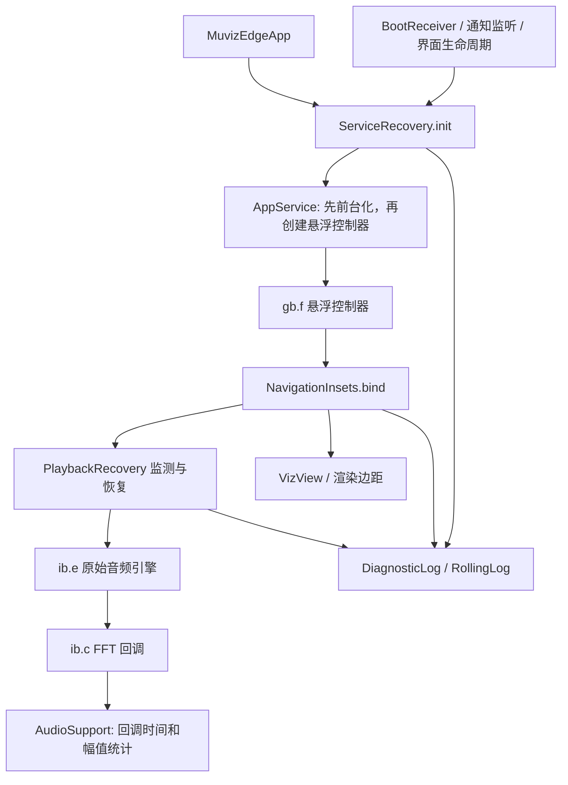

# 架构与代码定位

## 目录与产物

| 路径 | 用途 |
| --- | --- |
| `decoded/` | 可直接重编译的完整 APK 反编译内容，已经包含全部历史适配 |
| `decoded/smali/` | 原始主 DEX 和已插入的辅助层调用 |
| `src/com/sparkine/muvizedge/adaptive/` | 可阅读、维护的 Java 辅助层 |
| `stubs/` | 编译期混淆类声明，不参与 APK 打包 |
| `tests/` | 10 个独立 Java 测试入口 |
| `scripts/` | 编译、静态检查、签名、API 方法解析 |
| `baseline/Recovery148.apk` | 内容和 ABI 对比基线，也用于保留原 PNG 字节 |
| `verification/` | 148 smali 哈希、允许变化的方法和构建证明 |
| `vendor/` | 工具、运行时压缩包和 SHA256 清单 |
| `releases/` | 149–151 归档成品 |
| `.runtime/`、`build/`、`output/`、`.local/` | 本地产物 / 签名，不进 Git |

主 DEX 保留原始类；Java 辅助层单独生成 `classes2.dex`。将 `stubs` 合入 APK 会导致重复类或运行时行为被空实现替换。

## 主要调用链

## 辅助模块

| 模块 | 职责 / 修改入口 |
| --- | --- |
| `AdaptiveUi`、`DisplayPolicy` | 设备识别、Activity Context 的 density / locale、方向与设置刷新 |
| `AdaptiveSettingsActivity` | 显示模式、大小、语言、车机音频兼容、自动底部测量开关 |
| `UiTranslations`、`decoded/res/` | 动态文本与资源文本汉化 |
| `EdgeInsets`、`AudioPolicy.marginMax` | 扩大大屏手动边距上限，显示 px 数值 |
| `NavigationInsets`、`NavigationPolicy`、`AutoInsetPolicy` | 系统导航栏观测、旋转边映射、自动底边与防抖 |
| `AudioSupport`、`AudioPolicy` | 媒体播放判断、厂商音量兼容、真实 FFT 统计和显示条件诊断 |
| `PlaybackRecovery`、`RecoveryPolicy` | 播放回调 / 周期检查，采集缺失时退避重试、窗口丢失恢复 |
| `ServiceRecovery`、`StartupPolicy` | 前台服务接入、启动 / 唤醒 / 空 Intent 恢复与重试节流 |
| `CaptureDiagnostics`、`RenderDiagnostics` | 记录原始音频初始化和实际绘制结果 |
| `DiagnosticLog`、`RollingLog`、`DiagnosticExport` | 有界异步持久日志、轮转和下载目录导出 |
| `AudioDiagnosticsActivity` | 状态汇总、复制与导出入口 |

## 关键 smali 接入点

用符号定位，不依赖会随改版漂移的行号：

- `com/sparkine/muvizedge/activity/MuvizEdgeApp.smali`：应用初始化、已移除启动弹框的 `<clinit>`。
- `com/sparkine/muvizedge/service/AppService.smali`：`onCreate` 先 `created`，控制器建立后 `ready`；`onStartCommand` 首先交给 `command`；`onDestroy` 通知清理。
- `com/sparkine/muvizedge/receiver/BootReceiver.smali` 和 `service/AppNotificationListener.smali`：广播 / 监听恢复入口。
- `gb/f.smali`：两类悬浮 View 的绑定、原始显示门控和窗口操作错误记录。
- `ib/e.smali`：音频引擎，149 对 `e(Z)V` 只增加诊断；`f()` 是后台恢复复用的原始初始化入口。
- `ib/c.smali`：真实 FFT 回调进入 `AudioSupport.onFft`。
- `view/edgeviz/VizView.smali`：渲染器加载轮廓后应用导航栏边距。
- `xc/b.smali`：部分服务启动和播放判断经过辅助方法。
- `activity/DefineScreenActivity.smali`：边距滑条上限和标签。

查其他接入点时搜索 `Lcom/sparkine/muvizedge/adaptive/`。ABI 校验重点覆盖 `gb.f`、`nb.a`、`ib.e`、`ib.c`、`ib.s`、`g0.k`、`mb.l`。

## 显示与边距规则

自动识别首先尊重手动 `phone` / `large`，再检查 Automotive 特征或 car mode；否则要求自然横屏、density ≤ 240、最短边 ≥ 720 dp。2560 × 1600 / 160 dpi 符合此规则。自动大屏目标 density 为 320 dpi，控件约按 2 倍物理像素显示，字体另保留至少 1.1 的 fontScale；手机使用系统 density 和字号。

自动底边默认在大屏开启。Android 11+ 读取 `WindowInsets.Type.navigationBars()` 和可见性，结合窗口实际屏幕位置算重叠量；不重复避让已经由系统让出的区域。隐藏信号稳定 250 ms 后贴底。无法取得可靠测量时使用最近结果，初始未知则回退手动值。键盘区域不当成导航栏高度。

只修改当次加载的渲染轮廓，不写回用户手动设置。底边由 `NavigationPolicy.bottomEdge` 按渲染方向映射，不能简单认定 `nb.a.a()` 在任何旋转下都是屏幕底部。这里的尺寸都是物理 px。

## 持久设置

| SharedPreferences | 键 | 含义 |
| --- | --- | --- |
| `adaptive_display_language` | `mode` | `auto` / `phone` / `large` |
| 同上 | `scale` | 0 自动；100–250 百分比 |
| 同上 | `language` | `zh` / `en` / 跟随系统选项 |
| 同上 | `car_audio_compat` | 大屏默认开启，用媒体会话补充播放判断 |
| 同上 | `auto_bottom_inset` | 大屏默认开启，自动底部测量 |
| 同上 | `revision` | 设置变化时驱动 Activity 重建 |
| `MUVIZ_EDGE_PREF` | `EDGE_SHOW_ON_OVERLAY`、`SHOW_AOD` | 原程序功能启用状态 |
| 同上 | `HIDE_ON_*`、`IS_ONLY_MEDIA_APPS`、`IS_APPS_SELECTED`、`*_PKGS` | 原程序隐藏与应用选择门控 |

保留原门控，不应为了“总能看到律动”而忽略用户选择的隐藏条件。采集恢复判断针对缺失回调；连续的零 FFT 可能是静音，不能因此无限重建采集。

## 150 桌面控制栏补充判断

`DesktopSupport` 在独立线程查询已授权的 UsageEvents，`ForegroundPolicy` 跟踪实际前台 Activity，`DesktopInsetPolicy` 仅在确认 HOME 桌面时补充隐藏 / 未知的导航栏高度。新设置 `adaptive_display_language.desktop_inset_compat` 在大屏默认开启；权限、回退和诊断详见 `DESKTOP_COMPAT.md`。

151 的 `UsageAccessPolicy` 增加系统操作模式 / 默认权限回退及实际跨应用事件验证；`CaptureServicePolicy` 选择媒体或媒体 + microphone 服务类型，并限制失败重试。原始显示门控、FFT 采集方式、底边物理尺寸策略不变。详见 `ACCESS151.md`。
